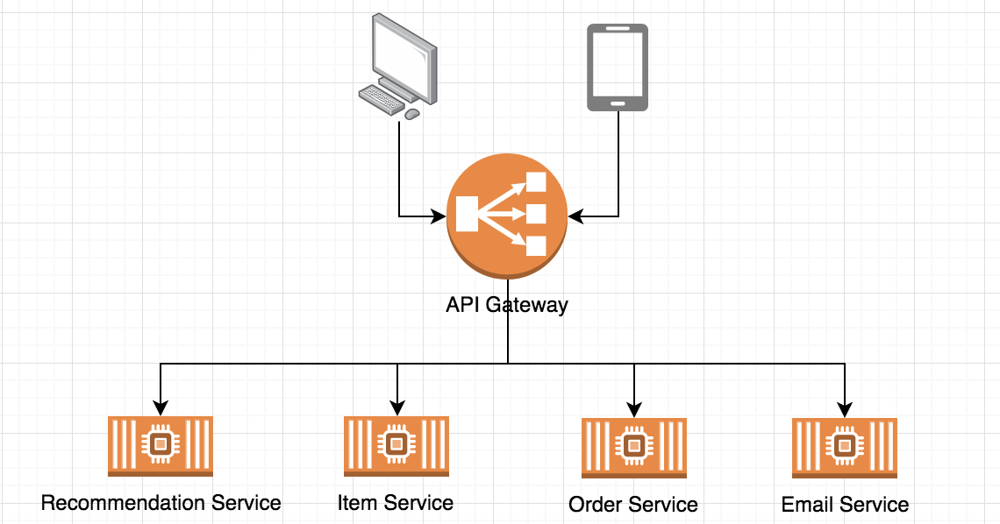
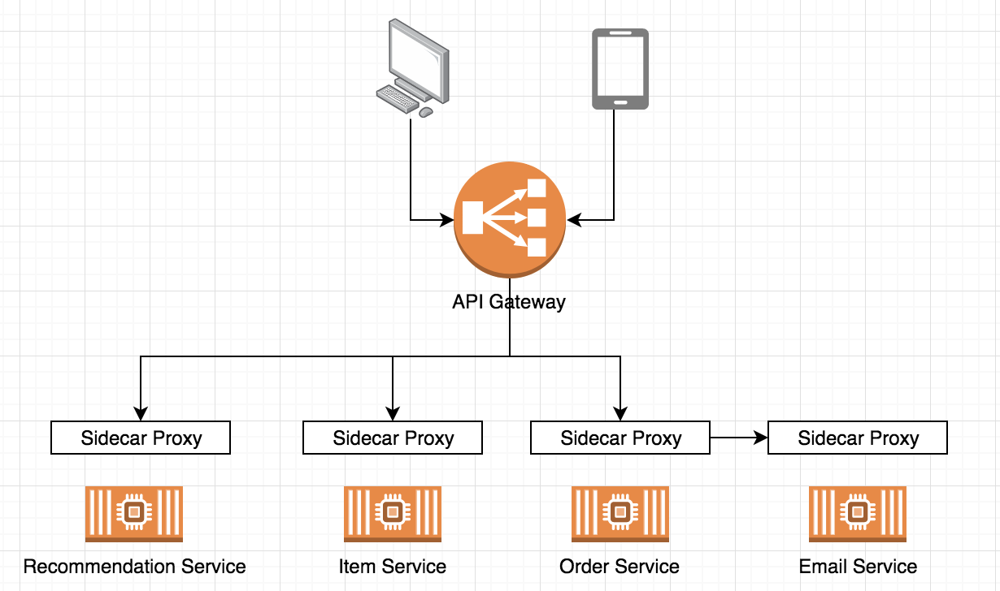
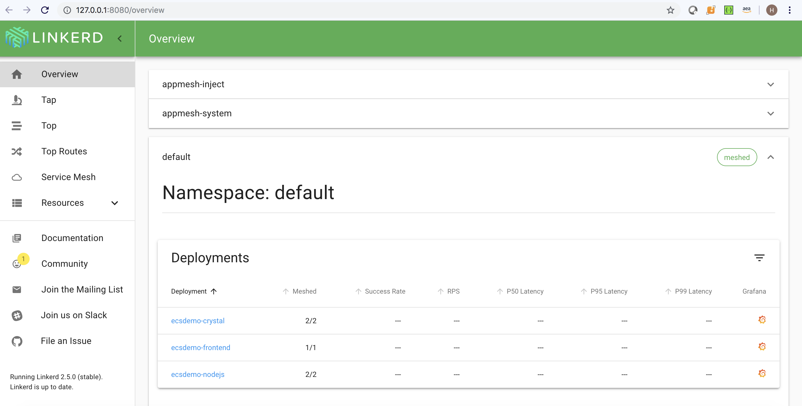
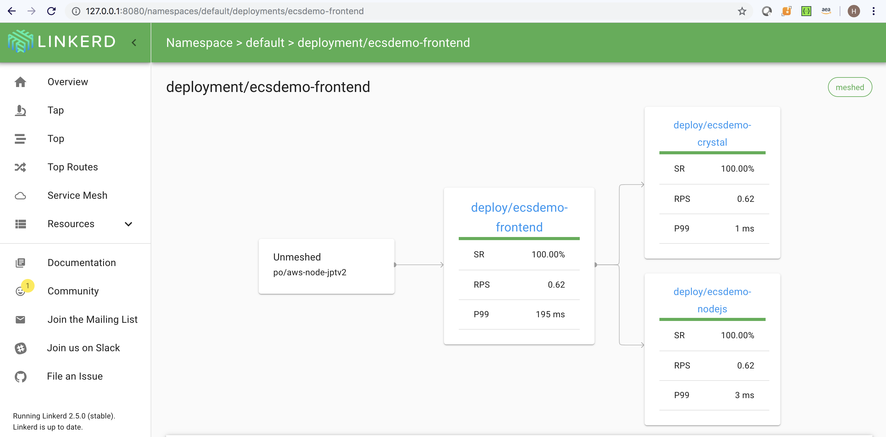
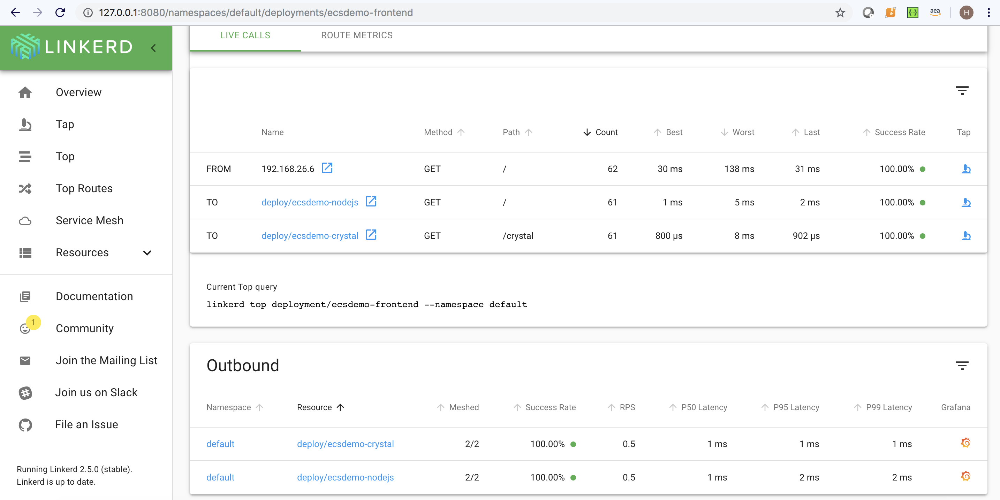
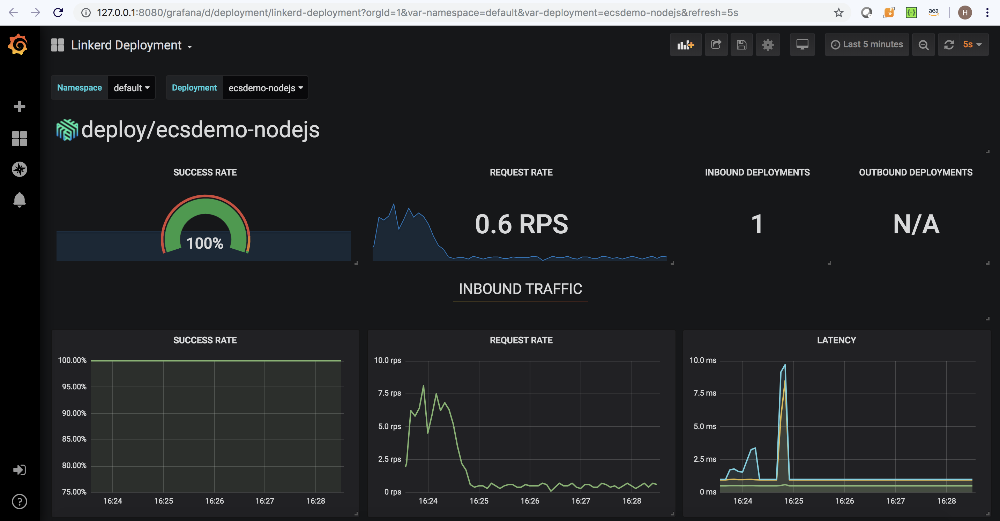
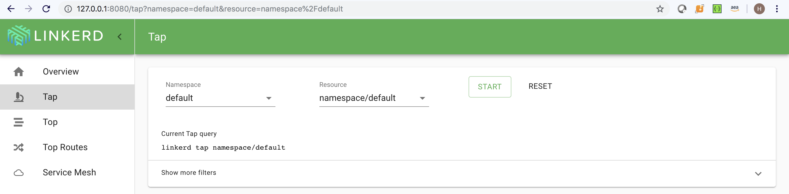
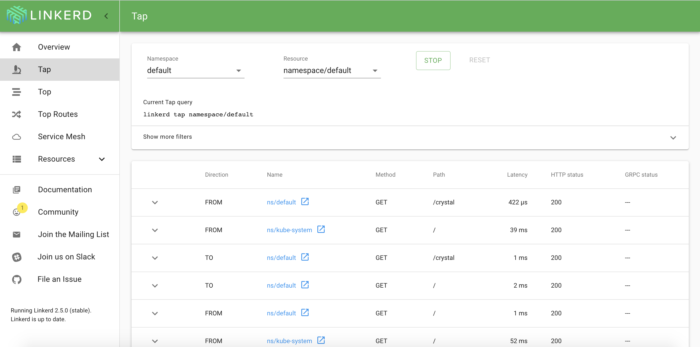
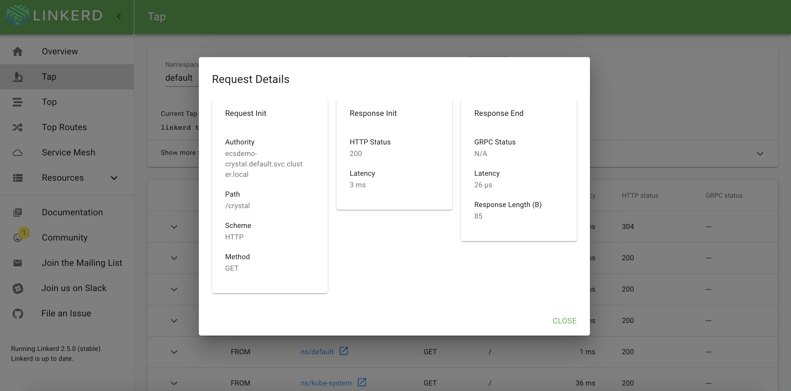

# Linkerd V2
<p>
This post will describes how to deploy Linkerd v2 as a service mesh for Amazon Elastic Kubernetes Service. In this example, we will be deploying latest verison of Linkerd, 2.5 which now supports helm. After Linkerd has been deployed, we will then deploy an nginx service, injecting the Linkerd Proxy, and launching the Linkerd dashboard. We will frist briefly review the benefits and challenges which a service mesh helps with. 
</p>

# Why a Service Mesh? 
<p>
As companies look to become more agile, there is a need to be able deliver small changes at a high velocity. As part of this appliaction's broken down into different components or services. This allows for components or services to be developed independently, and are often written in different languages. <br>

This is a natural transition to utilizing a microservice approach to architecting applications. Taking a microservices approach also assits the business and developers in being confident that the code which they write will not be able to affect the existing code of other components at all unless they explicitly write a connection between two microservices.<br>
<br>
Applications will continue to scale in terms on users count as well as number of services. As this increase occurs, there is a need to gain greater control of:
</p>

- Monitoring and Telemetry
- Reliability 
- Observability 
- Load Balancing 
- Service Discovery
- Traffic Shaping

### Microserivce Application Architecture


# What is a Service Mesh?
<p>
A Service Mesh is a dedicated infrastructure layer which provides Service-To-Serivce communications in safe, reliable, observable, and configurable way.  A Service Meshes main purpose is to be able to delivery messages from service A to service B. Service Meshes assists in migrating the network level complexities to outside of the application. This is handled by the side car proxy which is deployed along side the application container.<br>
<br>
If Service A wants to call another Service B, it doesn’t call the destination service directly, it routes the request first to the local proxy and the proxy routes it to the destination service. Essentially your service instance doesn’t have any idea about the outside world and is only aware about the local proxy.<br>
</p>


### Service-Mesh / Microservice Application Architecture


# Linkerd
<p>
Linkerd v1 was orginally released in 2016. In its previous iteration, Linkerd was a heavy java based project which was deployed on a per host basis. Linkerd v2, released in 2018, is a lightweight Rust based project which is deployed via sidecar proxy. This proxy will be deployed into the same Kubernetes pod which the application is deployed into. Linkerd exists between applications and takes responsibility for the Service-to-Service communication. 
</p>
<p>
Since the release of Linkerd v2, many updates have been made to the project. Linkerd current latest release is version 2.5. 
Linkerd now includes support for; helm, a highly available control plane, mutual TLS by default, automatic retries, and timeouts.
</p>

# Prereq's
Installation via helm requires one additional step which was taken care of by the linkerd install command. You must first create certifications to support TLS communication between pods. In this example we will do so using the project Step. If you have not used Step previously, you can install it via the command.
```bash
brew install step
```
Assumptions: 
- You have and EKS cluster deployed and are connected to it
- You have installed helm and configured helm.

For information on how to complete these assumptions please see https://eksworkshop.com

## Install CLI
```bash
curl -sL https://run.linkerd.io/install | sh
export PATH=$PATH:$HOME/.linkerd2/bin
```

## Clone Reposity locally
```bash
git clone --branch stable-2.5.0 git@github.com:linkerd/linkerd2.git; cd linkerd2
helm dependency update charts/linkerd2
```

<br>

## Create Certificates
We will create the certificates used by Linkerd using the following step commands
```bash
step certificate create identity.linkerd.cluster.local ca.crt ca.key --profile root-ca --no-password --insecure 
step certificate create identity.linkerd.cluster.local issuer.crt issuer.key --ca ca.crt --ca-key ca.key --profile intermediate-ca --not-after 8760h --no-password --insecure
```


# Install Linkerd via helm
```bash
helm install --set-file Identity.TrustAnchorsPEM=ca.crt --set-file Identity.Issuer.TLS.CrtPEM=issuer.crt --set-file Identity.Issuer.TLS.KeyPEM=issuer.key --set Identity.Issuer.CrtExpiry=$(date -v+8760H +"%Y-%m-%dT%H:%M:%SZ") charts/linkerd2
```

Once this command has been run successfully you should see the following output: <br>
```bash
NOTES:
Linkerd was successfully installed 🎉
```

### Run the following command to validate the installation. 
```bash
linkerd check
```
```bash
kubectl -n linkerd get deploy
```

### Auto Inject sidecar proxy
The applications we will be installing in the next step will reside in the namespace default. Create an annotation for this namespace which tells linkerd to auto inject the linkerd proxy side car. 
```bash
kubectl annotate namespace default linkerd.io/inject=enabled
```

# Deploy
We will deployed the same application which is used in the EKS workshop. 
```bash
git clone https://github.com/brentley/ecsdemo-frontend.git
git clone https://github.com/brentley/ecsdemo-nodejs.git
git clone https://github.com/brentley/ecsdemo-crystal.git
```

```bash
kubectl apply -f ecsdemo-nodejs/kubernetes/deployment.yaml
kubectl apply -f ecsdemo-nodejs/kubernetes/service.yaml

kubectl apply -f ecsdemo-crystal/kubernetes/deployment.yaml
kubectl apply -f ecsdemo-crystal/kubernetes/service.yaml

kubectl apply -f ecsdemo-frontend/kubernetes/deployment.yaml
kubectl apply -f ecsdemo-frontend/kubernetes/service.yaml
```

### Get the load balancer for the front end service
```bash 
kubectl get svc
```
### Output
```bash
NAME               TYPE           CLUSTER-IP       EXTERNAL-IP                                                               PORT(S)        AGE
ecsdemo-crystal    ClusterIP      10.100.49.96     <none>                                                                    80/TCP         20m
ecsdemo-frontend   LoadBalancer   10.100.169.201   ac5b78743e62d11e98b060a1d141ec45-1658447396.us-west-2.elb.amazonaws.com   80:31978/TCP   17m
ecsdemo-nodejs     ClusterIP      10.100.11.126    <none>                                                                    80/TCP         20m
kubernetes         ClusterIP      10.100.0.1       <none>
```
### Wait for the Load Balancer to be able to serve traffic. In a new browser tab, paste the url for the ecsdemo-frontend   LoadBalancer to generate traffic.

# Show Dashboarding
### Typing the linkerd dashboard will establish a connection on a random port and open up a browers on your workstation
After you enter the Linkerd Dashboard command , open another command prompt. You must leave the connect to the dashboard open to use it.
Launch the Linkerd Dashboard. <br>
```bash
linkerd dashboard &
```


### Frist look at dashboard
The applicaiton which we deployed reside in the default namespace. Once you are done exploring, click one of the applications which we deploy previously. 


### Once you have selected the application you can see metrics regarding requests per second and latency


### At this point we will scale the application and watch how the dashboard changes.
Scale up the backends 
```bash
kubectl scale deployment ecsdemo-frontend --replicas=2
kubectl scale deployment ecsdemo-nodejs --replicas=2
kubectl scale deployment ecsdemo-crystal --replicas=2
```
### One you are done inspecting that changes from the scaling events scroll down and click the grafana icon on the far right next to a service


### you are able to see detailed metrics of the service


### Go back to the Linkerd Tab in your browser and click Tap on the left had side and select the default namespace


### Click start and see the live traffic flowing threw the application


### Click a request and you are able to see more detailed request


# Wrapping up
### Delete applications deployments & services
```bash
kubectl delete -f ecsdemo-nodejs/kubernetes/deployment.yaml
kubectl delete -f ecsdemo-nodejs/kubernetes/service.yaml

kubectl delete -f ecsdemo-crystal/kubernetes/deployment.yaml
kubectl delete -f ecsdemo-crystal/kubernetes/service.yaml

kubectl delete -f ecsdemo-frontend/kubernetes/deployment.yaml
kubectl delete -f ecsdemo-frontend/kubernetes/service.yaml
```

### Find the name which helm deployed linkerd
Command:
```bash 
helm list
```
Output:
```bash
NAME          	REVISION	UPDATED                 	STATUS  	CHART               	APP VERSION 	NAMESPACE 
busted-horse  	1       	Tue Oct  1 06:49:38 2019	DEPLOYED	linkerd2-0.1.0      	stable-2.5.0	default  
```

### Delete linkerd helm deployment
```bash
helm delete busted-horse
```
